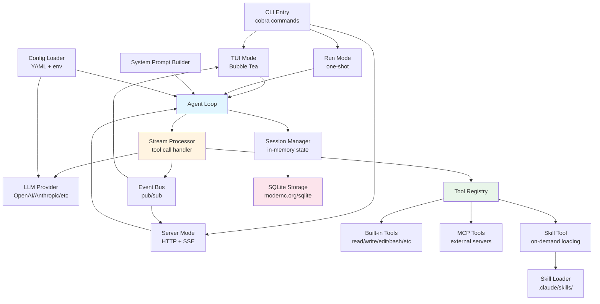

# gocode

`gocode` is a Go implementation of an OpenCode-style AI coding assistant.
It includes an interactive terminal UI, a headless HTTP server, session
persistence, a skill loader, and MCP-based tool extension.

## What is currently implemented

- Interactive TUI (`gocode tui`) backed by Bubble Tea
- Headless server mode (`gocode serve`) with REST + SSE endpoints
- One-shot non-interactive execution (`gocode run -p "..."`)
- Agent loop with tool calling, retries, and basic loop guard rails
- Built-in tools: `read`, `write`, `edit`, `list`, `glob`, `grep`, `bash`,
  `apply_patch`, `web_fetch`, `task`, `skill`, `todo_read`, `todo_write`
- MCP manager for local and remote servers, with MCP tools mounted into the
  runtime at startup
- SQLite-backed persistent sessions using `modernc.org/sqlite` (no CGO)
- Go SDK for driving the HTTP API from other Go programs (`pkg/sdk`)

## Quick start

### 1) Build

```bash
go build -o bin/gocode ./cmd/gocode
```

### 2) Configure provider

Copy `config.example.yaml` into one of the supported config locations and set
your API key.

Minimal config:

```yaml
provider:
  name: openai
  base_url: https://api.openai.com/v1
  api_key: ${OPENAI_API_KEY}
  model: gpt-4o

default_agent: build
```

You can also set credentials with environment variables such as
`OPENAI_API_KEY`, `ANTHROPIC_API_KEY`, `GOOGLE_API_KEY`, and
`OPENROUTER_API_KEY`.

### 3) Run

```bash
# Start interactive terminal UI
./bin/gocode tui

# Run a single prompt
./bin/gocode run -p "Create a small HTTP server in Go"

# Start API server only
./bin/gocode serve --addr :4096

# Show effective config
./bin/gocode config
```

## Command overview

- `gocode tui` - start interactive UI
- `gocode run` - execute a single prompt and print output
- `gocode serve` - run server without TUI
- `gocode mcp list|status|auth|logout` - inspect or manage MCP server auth state
- `gocode config` - print effective runtime config (API key is masked)

## Documentation

- `docs/cli.md` - CLI commands and common usage patterns
- `docs/configuration.md` - config schema, load order, and env overrides
- `docs/http-api.md` - implemented REST/SSE API endpoints and examples
- `docs/systemprompt-optimization.md` - system prompt architecture notes

## Architecture

### Component Diagram



### Directory Structure

```
gocode/
|- cmd/gocode/         # CLI entrypoint
|- internal/
|  |- agent/           # Agent registry and overrides
|  |- bus/             # Event bus
|  |- cli/             # Cobra commands + Bubble Tea UI
|  |- config/          # YAML + env configuration
|  |- llm/             # Multi-provider model integration
|  |- loop/            # Core agent execution loop
|  |- mcp/             # MCP clients + OAuth helpers
|  |- permission/      # Tool permission rules
|  |- processor/       # Stream and tool-call processor
|  |- server/          # HTTP routes and run manager
|  |- session/         # In-memory session model
|  |- skill/           # Skill discovery and loading
|  |- storage/         # SQLite persistence
|  |- systemprompt/    # System prompt builder
|  `- tool/            # Built-in tool implementations
`- pkg/sdk/            # Go SDK for server API
```

## Development

```bash
# Run all tests
go test ./...

# Build
go build ./cmd/gocode

# Use Make targets
make build
make test
make tui
make serve
```

## License

MIT
